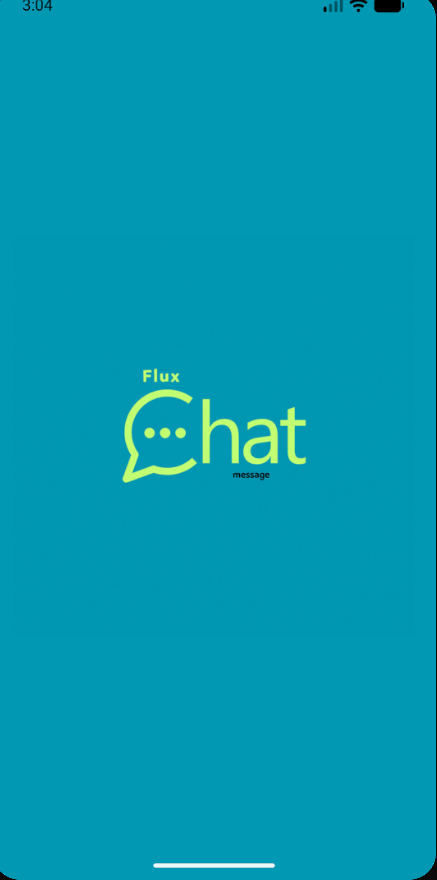
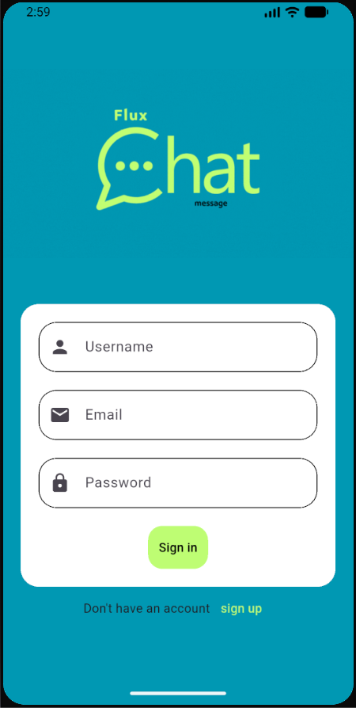
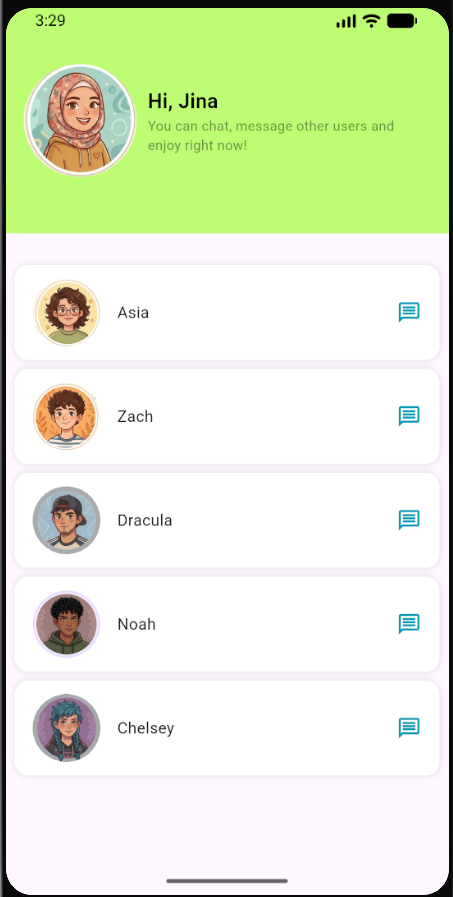
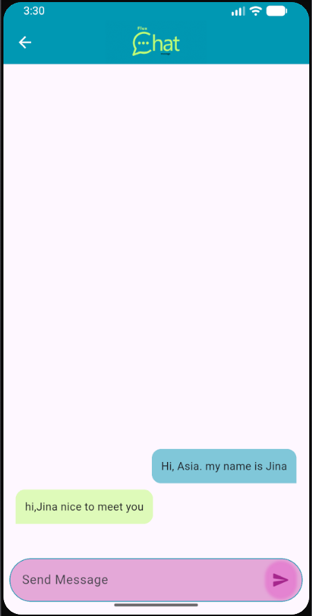
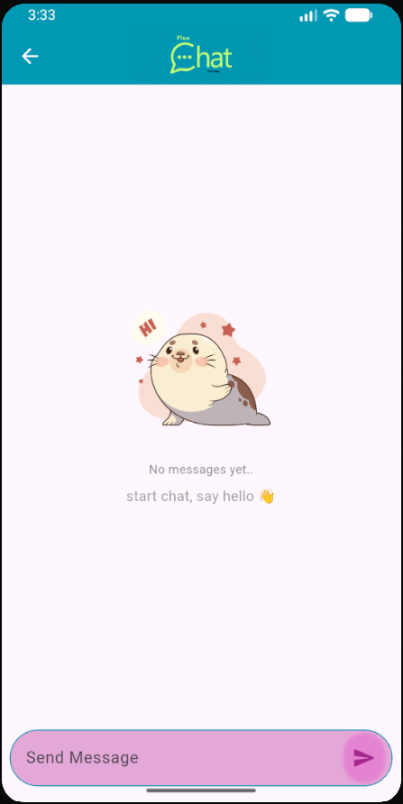

# 💬 FluxChat

A modern real-time chat application built with Flutter and Firebase.  
FluxChat delivers a seamless messaging experience with a clean UI, secure authentication, and instant communication.


---

## 📱 Overview

FluxChat is a cross-platform messaging application developed using Flutter and powered by Firebase. It enables users to connect in real time through a fast, secure, and intuitive interface.

Whether you're exploring real-time communication, learning Flutter, or building scalable chat applications, FluxChat serves as a solid foundation.

---

## ✨ Features

- 🔐 User Authentication (Email & Password)
- 👤 User Profile Management
- 💬 Real-Time One-to-One Messaging
- 📷 Profile Picture Support
- 📩 Instant Message Delivery
- ⏱️ Message Timestamps
- 🎨 Clean and Responsive UI
- ☁️ Cloud Data Storage with Firebase Firestore

---

## 🛠️ Built With

- **Flutter** – Cross-platform UI toolkit
- **Dart** – Programming language
- **Firebase Authentication** – Secure user login and registration
- **Cloud Firestore** – Real-time NoSQL database
- **Firebase Storage** – Media and profile image storage

---

## 📂 Project Structure

```bash
lib/
├── core/
│   ├── utils/
│   └── services/
├── features/
│   ├── auth/
│   ├── chat/
│   ├── home/
│   └── profile/
├── models/
├── widgets/
└── main.dart

```
##📸 Screenshots
<!--




 -->
<p align="center">
  
  
  
</p>

<p align="center">
  
  
</p>
